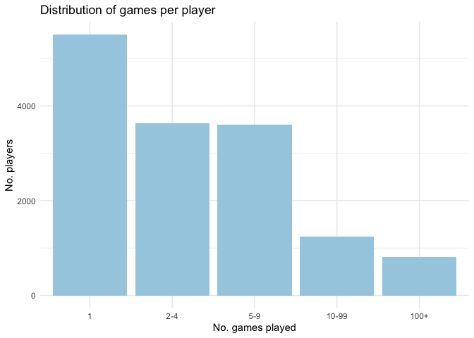
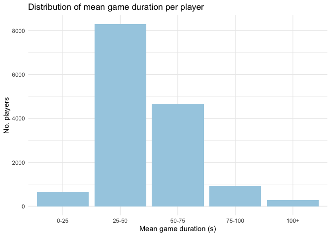
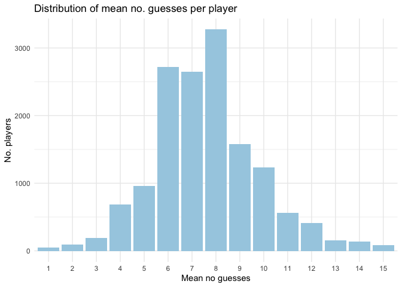
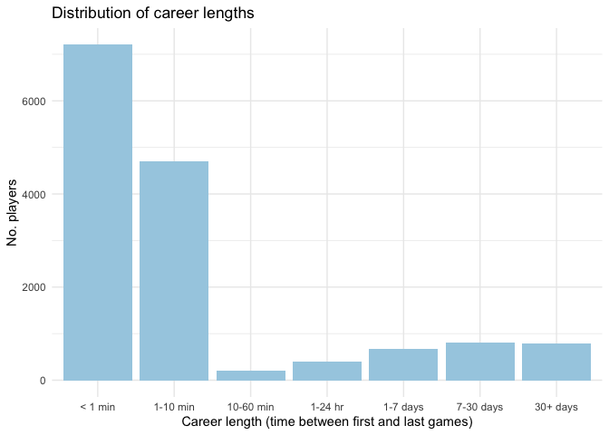
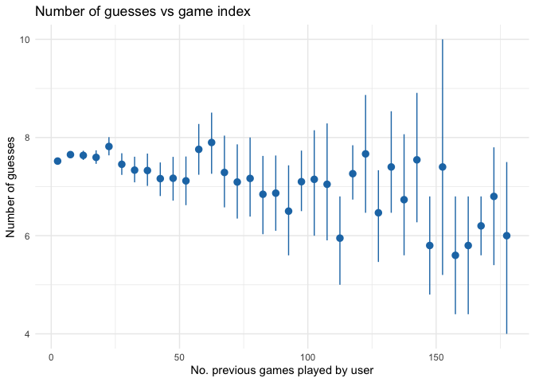

# Distribution of Data


```r
games <- read.csv("data/games.csv")
guesses <- read.csv("data/guesses.csv")
higher.lower <- read.csv("data/higher-lower-data2.csv")
repeat.player <- read.csv("data/repeat-player-prediction.csv")

paired <- brewer.pal(6, "Paired")
color1 <- paired[1]
color2 <- paired[2]
color3 <- paired[3]
```


```r
summary(games)
```

```
##                                   gameId           user      
##  00026a5a-cab7-4e96-90a4-c7dbc5bdbde1:    1   Min.   :    0  
##  000331e0-3129-4303-93db-777fd5901a58:    1   1st Qu.: 3888  
##  0004ee26-4d75-497a-8ca7-c14aec575f72:    1   Median : 7576  
##  00054ce9-9b20-4198-ba6c-b108c6b5aa72:    1   Mean   : 7557  
##  000577d2-a6b5-4811-8740-c753e21452cd:    1   3rd Qu.:11193  
##  0005a359-0253-4b71-a7b4-3ab47f2ef54d:    1   Max.   :15042  
##  (Other)                             :50875                  
##                    startTime                       finishTime   
##  2019-09-21 11:18:51.139:    1   2019-09-21 11:19:37.088:    1  
##  2019-09-21 11:19:32.344:    1   2019-09-21 11:20:06.389:    1  
##  2019-09-21 11:20:19.084:    1   2019-09-21 11:21:46.455:    1  
##  2019-09-21 11:21:59.364:    1   2019-09-21 11:23:30.844:    1  
##  2019-09-21 11:24:43.279:    1   2019-09-21 11:25:54.891:    1  
##  2019-09-21 11:26:41.290:    1   2019-09-21 11:27:38.956:    1  
##  (Other)                :50875   (Other)                :50875  
##     duration        targetNum        numGuesses         guess1      
##  Min.   :  6.00   Min.   :  1.00   Min.   : 1.000   Min.   :  1.00  
##  1st Qu.: 34.00   1st Qu.: 25.00   1st Qu.: 6.000   1st Qu.: 26.00  
##  Median : 45.00   Median : 50.00   Median : 7.000   Median : 50.00  
##  Mean   : 48.75   Mean   : 50.06   Mean   : 7.548   Mean   : 46.18  
##  3rd Qu.: 60.00   3rd Qu.: 75.00   3rd Qu.: 9.000   3rd Qu.: 60.00  
##  Max.   :299.00   Max.   :100.00   Max.   :15.000   Max.   :100.00  
##                                                                     
##      guess2           guess3           guess4           guess5     
##  Min.   :  1.00   Min.   :  1.00   Min.   :  1.00   Min.   :  1.0  
##  1st Qu.: 25.00   1st Qu.: 25.00   1st Qu.: 22.00   1st Qu.: 22.0  
##  Median : 49.00   Median : 48.00   Median : 48.00   Median : 48.0  
##  Mean   : 47.32   Mean   : 47.97   Mean   : 48.45   Mean   : 48.6  
##  3rd Qu.: 70.00   3rd Qu.: 70.00   3rd Qu.: 72.00   3rd Qu.: 74.0  
##  Max.   :100.00   Max.   :100.00   Max.   :100.00   Max.   :100.0  
##  NA's   :584      NA's   :1661     NA's   :3579     NA's   :6727   
##      guess6           guess7           guess8           guess9      
##  Min.   :  1.00   Min.   :  1.00   Min.   :  1.00   Min.   :  1.00  
##  1st Qu.: 22.00   1st Qu.: 23.00   1st Qu.: 24.00   1st Qu.: 25.00  
##  Median : 49.00   Median : 50.00   Median : 51.00   Median : 52.00  
##  Mean   : 48.74   Mean   : 49.34   Mean   : 50.34   Mean   : 50.88  
##  3rd Qu.: 75.00   3rd Qu.: 75.00   3rd Qu.: 77.00   3rd Qu.: 77.00  
##  Max.   :100.00   Max.   :100.00   Max.   :100.00   Max.   :100.00  
##  NA's   :11831    NA's   :18929    NA's   :26921    NA's   :33882   
##     guess10          guess11         guess12          guess13     
##  Min.   :  1.00   Min.   :  1.0   Min.   :  1.00   Min.   :  1.0  
##  1st Qu.: 26.00   1st Qu.: 26.0   1st Qu.: 28.00   1st Qu.: 27.0  
##  Median : 52.00   Median : 53.0   Median : 54.00   Median : 53.0  
##  Mean   : 51.38   Mean   : 51.7   Mean   : 52.65   Mean   : 51.9  
##  3rd Qu.: 78.00   3rd Qu.: 77.0   3rd Qu.: 78.00   3rd Qu.: 77.0  
##  Max.   :100.00   Max.   :100.0   Max.   :100.00   Max.   :100.0  
##  NA's   :39190    NA's   :43066   NA's   :45828    NA's   :47743  
##     guess14          guess15      
##  Min.   :  1.00   Min.   :  1.00  
##  1st Qu.: 31.00   1st Qu.: 34.00  
##  Median : 54.00   Median : 55.00  
##  Mean   : 53.35   Mean   : 54.69  
##  3rd Qu.: 77.00   3rd Qu.: 77.00  
##  Max.   :100.00   Max.   :100.00  
##  NA's   :49099    NA's   :50122
```

```r
head(games)
```

```
##                                 gameId  user               startTime
## 1 a6d0fa4f-6efa-43f4-9d63-6575f31eb5a2 12884 2019-09-21 11:18:51.139
## 2 27b85f0d-cc3d-45fd-825b-3eb23381c70f  3717 2019-09-21 11:19:32.344
## 3 5906973a-3c8f-4a30-a513-c75ede4f59be  3717 2019-09-21 11:20:19.084
## 4 b4af0384-23dc-4715-9b9e-c89d80c1505e  3717 2019-09-21 11:21:59.364
## 5 5bf4f71b-92cd-460c-81af-181adf5ddb32 14239 2019-09-21 11:24:43.279
## 6 153f14fa-5b7c-4d1e-9f90-210b8722c21f  3717 2019-09-21 11:26:41.290
##                finishTime duration targetNum numGuesses guess1 guess2
## 1 2019-09-21 11:19:37.088       46         5          6     41     39
## 2 2019-09-21 11:20:06.389       34        12          7     52     38
## 3 2019-09-21 11:21:46.455       87        67         14     10     34
## 4 2019-09-21 11:23:30.844       91        87         13    100     61
## 5 2019-09-21 11:25:54.891       72        44         11     64     30
## 6 2019-09-21 11:27:38.956       58         3         11     82     71
##   guess3 guess4 guess5 guess6 guess7 guess8 guess9 guess10 guess11 guess12
## 1     20     10      7      5     NA     NA     NA      NA      NA      NA
## 2     10     24     20     40     12     NA     NA      NA      NA      NA
## 3     53     54     60     70     61      3     63      66      69      68
## 4     70     71     73     29     79      1     81      91      89      88
## 5     35     36     80     40     50     41     45      43      44      NA
## 6     60     50     40     10      9      8      7       6       3      NA
##   guess13 guess14 guess15
## 1      NA      NA      NA
## 2      NA      NA      NA
## 3       7      67      NA
## 4      87      NA      NA
## 5      NA      NA      NA
## 6      NA      NA      NA
```

## Grouping by ppt

Here I pulled out some summary info by player.


```r
# Cast dates as POSIX so we can manipulate them
games <- games %>%
  mutate(
    startTimePOSIX = as.POSIXct(startTime)
  )

# Create a summary df grouped by user
games.by.user <- games %>% 
  group_by(user) %>%
  summarise(
    # Number of games played
    no_games=n(),
    # Date of first game
    first_game=min(startTimePOSIX),
    # Date of last game
    last_game=max(startTimePOSIX),
    # Mean duration of games
    mean_duration=mean(duration),
    # Mean no_guesses
    mean_guesses=mean(numGuesses)
  ) %>%
  mutate(
    # bin no_games into roughly even chunks
    no_games_bin=cut(
      no_games,
      breaks = c(0, 1, 2, 5, 10, 200),
      labels = c("1", "2-4", "5-9", "10-99", "100+"),
      ),
    # find the time between first and last games
    career_length = last_game - first_game
  )

games.by.user.summary <- summary(games.by.user)

games.by.user.summary
```

```
##       user          no_games         first_game                 
##  Min.   :    0   Min.   :  1.000   Min.   :2019-09-21 11:18:51  
##  1st Qu.: 3751   1st Qu.:  1.000   1st Qu.:2019-10-30 16:32:22  
##  Median : 7512   Median :  2.000   Median :2019-11-28 16:14:48  
##  Mean   : 7514   Mean   :  3.442   Mean   :2019-11-29 00:23:30  
##  3rd Qu.:11276   3rd Qu.:  4.000   3rd Qu.:2019-12-31 13:42:42  
##  Max.   :15042   Max.   :178.000   Max.   :2020-01-20 20:15:46  
##    last_game                   mean_duration     mean_guesses   
##  Min.   :2019-09-21 11:18:51   Min.   :  6.00   Min.   : 1.000  
##  1st Qu.:2019-11-04 01:07:28   1st Qu.: 37.40   1st Qu.: 6.000  
##  Median :2019-12-05 22:04:04   Median : 46.00   Median : 7.500  
##  Mean   :2019-12-03 07:49:52   Mean   : 49.38   Mean   : 7.593  
##  3rd Qu.:2020-01-03 20:37:13   3rd Qu.: 57.62   3rd Qu.: 9.000  
##  Max.   :2020-01-20 20:32:28   Max.   :272.00   Max.   :15.000  
##  no_games_bin career_length    
##  1    :5500   Length:14782     
##  2-4  :3630   Class :difftime  
##  5-9  :3601   Mode  :numeric   
##  10-99:1237                    
##  100+ : 814                    
## 
```

There's a huge range between players in terms of how many games they played (1-178), how long their games took (6 - 272 secs), but a ceiling at how many guesses they could take at 15.

### How many games did each player play?


```r
# Plot density of no_games 
games.by.user %>%
  ggplot(aes(x=no_games_bin)) +
  geom_bar(fill=color1) +
  theme_minimal() +
  labs(
    title="Distribution of games per player",
    x = "No. games played",
    y = "No. players"
  )
```

<!-- -->

Here we can see the majority of players played just 1-4 times, while a small number of players played >100 games. This isn't that surprising, but worth bearing in mind as any investigation of the effects of learning might be heavily skewed by this small group of fellow nerds.

### How much time did players spend per-game?


```r
# Create bins for mean_duration
games.by.user <- games.by.user %>%
  mutate(
    mean_duration_bin = cut(
      mean_duration,
      # breaks = c(0, 1, 2, 5, 10, 200),
      # labels = c("1", "2-4", "5-9", "10-99", "100+"),
      breaks = c(0, 25, 50, 75, 100, 300),
      labels = c("0-25", "25-50", "50-75", "75-100", "100+"))
  )

games.by.user %>%
  ggplot(aes(x=mean_duration_bin)) +
  geom_bar(fill=color1) +
  theme_minimal() +
  labs(
    title="Distribution of mean game duration per player",
    x = "Mean game duration (s)",
    y = "No. players"
  )
```

<!-- -->

Again there's a very high spread but the majority of games take around a minute.


### How many guesses did players take on average?


```r
# Create bins for mean_duration
games.by.user <- games.by.user %>%
  mutate(
    mean_guesses_bin = as.factor(round(mean_guesses))
  )

games.by.user %>%
  ggplot(aes(x=mean_guesses_bin)) +
  geom_bar(fill=color1) +
  theme_minimal() +
  labs(
    title="Distribution of mean no. guesses per player",
    x = "Mean no guesses",
    y = "No. players"
  )
```

<!-- -->

These look pretty normally distributed!


### Over what period did people play?


```r
# Create bins for mean_duration
games.by.user <- games.by.user %>%
  mutate(
    career_length = as.numeric(
      difftime(last_game, first_game, units="hours")),
    career_length_bin = cut(
      career_length,
      breaks=c(-0.01, 0.01667, 0.1667, 1, 24, 168, 720, 3000),
      labels=c("< 1 min", "1-10 min", "10-60 min", "1-24 hr", "1-7 days", "7-30 days", "30+ days")
    )
  )

games.by.user %>%
  ggplot(aes(x=career_length_bin)) +
  geom_bar(fill=color1) +
  theme_minimal() +
  labs(
    title="Distribution of career lengths",
    x = "Career length (time between first and last games)",
    y = "No. players"
  )
```

<!-- -->

The distribution of "career lengths" is even more striking. The majority if players had <10 mins between their first and last games, but a decent number (801) kept playing for over a month.

## Participant ability

### Do participants get better over time?


```r
# Add a column with the by-ppt game index (was it their 1st, 2nd, 3rd game etc)
games <- games %>%
  group_by(user) %>%
  mutate(
    game_idx = dense_rank(startTimePOSIX)
  ) %>%
  arrange(user, game_idx)

head(games)
```

```
## # A tibble: 6 x 24
## # Groups:   user [1]
##   gameId  user startTime finishTime duration targetNum numGuesses guess1
##   <fct>  <int> <fct>     <fct>         <int>     <int>      <int>  <int>
## 1 ee15d…     0 2019-09-… 2019-09-2…       40        32          7     86
## 2 551f6…     0 2019-09-… 2019-09-2…       42        36          7     50
## 3 aedab…     0 2019-09-… 2019-09-2…       55        43          9     20
## 4 12f03…     0 2019-09-… 2019-09-2…       39        33          7     22
## 5 b5319…     0 2019-09-… 2019-09-2…       45        22          9     80
## 6 7a36d…     0 2019-09-… 2019-09-2…       30        26          5     30
## # … with 16 more variables: guess2 <int>, guess3 <int>, guess4 <int>,
## #   guess5 <int>, guess6 <int>, guess7 <int>, guess8 <int>, guess9 <int>,
## #   guess10 <int>, guess11 <int>, guess12 <int>, guess13 <int>,
## #   guess14 <int>, guess15 <int>, startTimePOSIX <dttm>, game_idx <int>
```


```r
games %>%
  ggplot(aes(game_idx, numGuesses)) +
  stat_summary_bin(fun.data="mean_cl_boot",
                   geom="pointrange",
                   binwidth = 5,
                   color=color2) +
  theme_minimal() + 
  labs(
    title="Number of guesses vs game index",
    x = "No. previous games played by user",
    y = "Number of guesses"
  )
```

<!-- -->

I couldn't figure out a better way to plot this. It basically shows the mean number of guesses needed to complete each game against the "game index", or the number of games the user had played up until this point.

There does seem to be a downward trend but it's not as dramatic as I was expecting. Maybe this is because people who play for a long period of time are not very good (e.g. children, definition of madness etc), or because no_guesses is too weak of a measure (it can still be tough to get the number quickly even if you are using a good strategy).


```r
m1 <- lm(numGuesses ~ game_idx, data=games)
summary(m1)
```

```
## 
## Call:
## lm(formula = numGuesses ~ game_idx, data = games)
## 
## Residuals:
##     Min      1Q  Median      3Q     Max 
## -6.5659 -1.5659 -0.5398  1.4602  7.6364 
## 
## Coefficients:
##              Estimate Std. Error t value Pr(>|t|)    
## (Intercept)  7.569206   0.014475 522.899  < 2e-16 ***
## game_idx    -0.003264   0.001054  -3.097  0.00196 ** 
## ---
## Signif. codes:  0 '***' 0.001 '**' 0.01 '*' 0.05 '.' 0.1 ' ' 1
## 
## Residual standard error: 2.879 on 50879 degrees of freedom
## Multiple R-squared:  0.0001885,	Adjusted R-squared:  0.0001688 
## F-statistic:  9.59 on 1 and 50879 DF,  p-value: 0.001957
```

A linear model shows a strong relationship between numGuesses and game_index (you expect to make one fewer guess about every 300 games).


```r
model.game_idx.guesses.null <- lmer(numGuesses ~ (1 + game_idx | user), data=games)
```

```
## boundary (singular) fit: see ?isSingular
```

```r
summary(model.game_idx.guesses.null)
```

```
## Linear mixed model fit by REML ['lmerMod']
## Formula: numGuesses ~ (1 + game_idx | user)
##    Data: games
## 
## REML criterion at convergence: 251624.9
## 
## Scaled residuals: 
##     Min      1Q  Median      3Q     Max 
## -2.8657 -0.6158 -0.1007  0.5607  2.9437 
## 
## Random effects:
##  Groups   Name        Variance  Std.Dev.  Corr
##  user     (Intercept) 4.122e-01 0.6420233     
##           game_idx    8.757e-08 0.0002959 1.00
##  Residual             7.875e+00 2.8062830     
## Number of obs: 50881, groups:  user, 14782
## 
## Fixed effects:
##             Estimate Std. Error t value
## (Intercept)  7.56078    0.01466   515.6
## convergence code: 0
## boundary (singular) fit: see ?isSingular
```

```r
model.game_idx.guesses <- lmer(numGuesses ~ game_idx + (1 + game_idx | user), data=games)
```

```
## Warning in checkConv(attr(opt, "derivs"), opt$par, ctrl =
## control$checkConv, : Model failed to converge with max|grad| = 0.229843
## (tol = 0.002, component 1)
```

```
## Warning in checkConv(attr(opt, "derivs"), opt$par, ctrl = control$checkConv, : Model is nearly unidentifiable: very large eigenvalue
##  - Rescale variables?
```

```r
summary(model.game_idx.guesses)
```

```
## Linear mixed model fit by REML ['lmerMod']
## Formula: numGuesses ~ game_idx + (1 + game_idx | user)
##    Data: games
## 
## REML criterion at convergence: 251627
## 
## Scaled residuals: 
##     Min      1Q  Median      3Q     Max 
## -2.9126 -0.6172 -0.1020  0.5592  2.9461 
## 
## Random effects:
##  Groups   Name        Variance  Std.Dev. Corr
##  user     (Intercept) 3.882e-01 0.623039     
##           game_idx    2.387e-05 0.004885 0.72
##  Residual             7.878e+00 2.806858     
## Number of obs: 50881, groups:  user, 14782
## 
## Fixed effects:
##             Estimate Std. Error t value
## (Intercept) 7.534561   0.016343 461.039
## game_idx    0.006702   0.001869   3.586
## 
## Correlation of Fixed Effects:
##          (Intr)
## game_idx -0.439
## convergence code: 0
## Model failed to converge with max|grad| = 0.229843 (tol = 0.002, component 1)
## Model is nearly unidentifiable: very large eigenvalue
##  - Rescale variables?
```

```r
anova(model.game_idx.guesses, model.game_idx.guesses.null)
```

```
## refitting model(s) with ML (instead of REML)
```

```
## Data: games
## Models:
## model.game_idx.guesses.null: numGuesses ~ (1 + game_idx | user)
## model.game_idx.guesses: numGuesses ~ game_idx + (1 + game_idx | user)
##                             npar    AIC    BIC  logLik deviance Chisq Df
## model.game_idx.guesses.null    5 251628 251672 -125809   251618         
## model.game_idx.guesses         6 251622 251675 -125805   251610 8.725  1
##                             Pr(>Chisq)   
## model.game_idx.guesses.null              
## model.game_idx.guesses        0.003139 **
## ---
## Signif. codes:  0 '***' 0.001 '**' 0.01 '*' 0.05 '.' 0.1 ' ' 1
```

A linear mixed effects model (which takes into account the variance between participants), shows a stronger relationship (it predicts you will make one fewer guess every 150 games). A likelihood ratio test against a null model shows the effect to be significant.

## How good are the best participants?

If we just sort by the mean lowest number of guesses, there is probably a lot of luck involved.


```r
games.by.user %>%
  arrange(desc(mean_guesses)) %>% 
  head(20)
```

```
## # A tibble: 20 x 11
##     user no_games first_game          last_game           mean_duration
##    <int>    <int> <dttm>              <dttm>                      <dbl>
##  1   201        1 2020-01-04 17:53:23 2020-01-04 17:53:23           87 
##  2   244        1 2020-01-12 08:14:43 2020-01-12 08:14:43           95 
##  3   437        1 2019-12-25 04:18:42 2019-12-25 04:18:42          149 
##  4   739        1 2019-11-21 14:05:59 2019-11-21 14:05:59           72 
##  5  1025        1 2019-10-23 17:26:13 2019-10-23 17:26:13          212 
##  6  1904        2 2019-12-21 21:35:59 2019-12-21 21:38:18          150.
##  7  1920        1 2019-12-01 17:48:31 2019-12-01 17:48:31          107 
##  8  2122        1 2019-12-29 23:11:33 2019-12-29 23:11:33           83 
##  9  2208        1 2019-11-04 18:53:00 2019-11-04 18:53:00          169 
## 10  2235        1 2019-11-17 13:12:42 2019-11-17 13:12:42          133 
## 11  2370        2 2019-11-09 04:10:20 2019-11-18 14:25:14           88 
## 12  2404        1 2020-01-18 09:57:30 2020-01-18 09:57:30           97 
## 13  2633        1 2019-11-06 16:06:12 2019-11-06 16:06:12           97 
## 14  2745        2 2020-01-13 16:57:13 2020-01-13 16:59:17          120.
## 15  3076        1 2020-01-19 16:20:54 2020-01-19 16:20:54           69 
## 16  3079        1 2019-12-04 00:31:09 2019-12-04 00:31:09           71 
## 17  3211        1 2019-11-28 16:00:52 2019-11-28 16:00:52          111 
## 18  3456        1 2019-12-28 06:29:36 2019-12-28 06:29:36          127 
## 19  3466        1 2019-11-08 14:50:53 2019-11-08 14:50:53          102 
## 20  4652        1 2020-01-13 14:28:44 2020-01-13 14:28:44           75 
## # … with 6 more variables: mean_guesses <dbl>, no_games_bin <fct>,
## #   career_length <dbl>, mean_duration_bin <fct>, mean_guesses_bin <fct>,
## #   career_length_bin <fct>
```

Most of these people just played 1 or 2 games.

So let's try excluding anyone who played < 10 games, and also getting a measure of their variance.


```r
high.performers <- games %>%
  group_by(user) %>%
  summarise(
    no_games=n(),
    mean_guesses=mean(numGuesses),
    sd_guesses=sd(numGuesses)
  ) %>%
  filter(
    no_games > 9
  ) %>%
  arrange(mean_guesses)

high.performers %>%
  filter(
    sd_guesses < 1.5,
    )
```

```
## # A tibble: 28 x 4
##     user no_games mean_guesses sd_guesses
##    <int>    <int>        <dbl>      <dbl>
##  1 14063       15         5.67       1.45
##  2  3896       45         5.69       1.36
##  3   297       13         6          1.08
##  4 12377       12         6          1.28
##  5  2409       10         6.1        1.45
##  6  9248       11         6.18       1.40
##  7 14410       11         6.18       1.17
##  8  1813       10         6.3        1.49
##  9  8020       10         6.3        1.16
## 10  4366       13         6.38       1.19
## # … with 18 more rows
```


